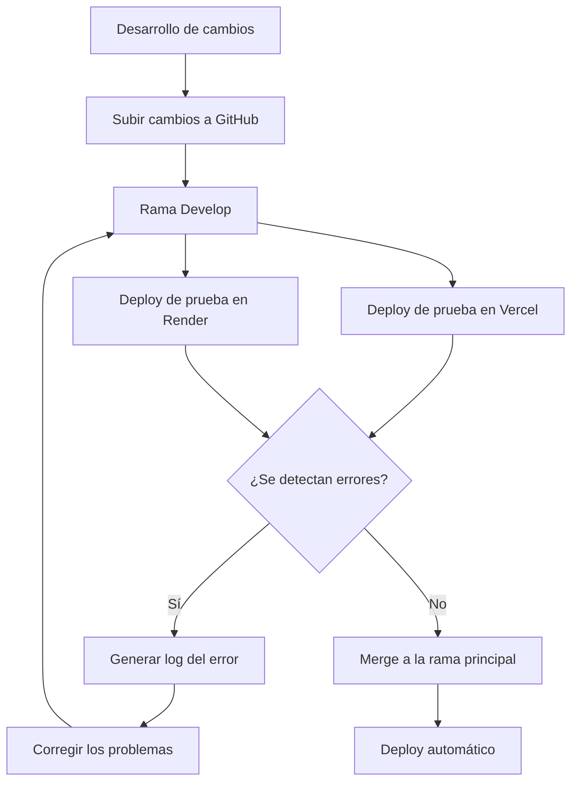

# Fase 2 - Implementación

## 0. Adaptación y cambios

La directiva está trabajando en un ERP propio al que, por ahora, no se tiene acceso. Antes de definir cualquier alcance de modificación sobre ese sistema, se establecerá el siguiente flujo preliminar:

1. **Acceso:** se recibe primero un usuario para entrar al ERP y solo observar (sin modificar nada).
2. **Adaptación:** comprender el sistema, su lenguaje, arquitectura, módulos y forma de operar; posteriormente capacitar al resto del equipo.
3. **Verificación:** validar que el acceso, los datos y el funcionamiento del ERP son los esperados.
4. **Propuesta de cambios:** solo después de adaptarse y verificar, se proponen cambios concretos sobre el sistema. El ERP que estaba desarrollando y el que está desarrollando la empresa se volverán uno solo apuntando siempre a la mejora estructural, funcionalidades necesarias y mejora continua

> **Nota:** este flujo aún no está del todo definido; se detalla aquí a grandes rasgos y será refinado una vez se reciba el acceso real.

---

## 1. Objetivo

La Fase 2 tiene como propósito consolidar en Greenline las mejores prácticas operativas y arquitectónicas de un ERP moderno. La meta es construir una plataforma propia, coherente y escalable, basada en permisos granulares, auditoría, stock con aprobaciones, dashboard ejecutivo, flujo de pedidos, UX operativa y contratos API consistentes.

Greenline debe evolucionar hacia un ERP especializado en movilidad eléctrica: una solución que conecte ventas, inventario, tiendas, distribución, comunidad, servicio técnico y atención posventa en una sola operación confiable.

### Objetivos y resultados esperados
- Definir claramente los objetivos del proyecto y los resultados esperados con cada implementación.
- Aclarar qué se busca conseguir, cómo se medirán los resultados y cómo se presentarán ante la dirección.

---

## 2. Principios que guiarán la implementación

1. Implementar patrones de arquitectura y dominio que aporten valor real a Greenline.
2. Diseñar e implementar cada módulo de negocio de acuerdo con el contexto, los procesos y las necesidades de Greenline.
3. Respetar la base actual del proyecto: React 19 + Vite, Supabase/PostgreSQL, Prisma, RBAC, middleware y estructura modular.
4. Priorizar el backend y la operatividad sobre la estética de la UI.
5. Mantener fuerza de negocio y trazabilidad: cada acción relevante debe quedar registrada con usuario, fecha, motivo y estado.
6. Definir interfaces claras entre frontend, backend y datos para reducir regresiones.
7. Levantar primero la información operativa y validar los responsables de cada área antes de cerrar el diseño.
8. Implementar parcialmente las capacidades que dependen de usuarios de tiendas y técnicos hasta que esos perfiles existan formalmente.

---

## 3. Alcance funcional de la Fase 2

La implementación se dividirá en estos bloques:

- Seguridad y permisos
- Auditoría y trazabilidad
- Inventario y stock con aprobación
- Pedidos, entregas y seguimiento
- Dashboard operativo
- Notificaciones internas
- API y contratos estándar
- UX de panel administrativo
- Observabilidad y salud del sistema
- Documentación de dominio y mantenimiento
- Levantamiento de información y definición de responsables
- Usuarios independientes por área y autenticación mediante QR
- Comunidad, participación y fidelización
- Sistema unificado de citas de servicio técnico, en alcance parcial
- Réplica de la página de la DUA (definición de alcance y funcionalidades)
- Arquitectura de microservicios para el ERP y separación de repositorios

### 3.1. Levantamiento de información sobre la Fase 2

Antes de construir cada módulo se debe levantar y validar la información real de la operación. El levantamiento será un entregable de esta fase, no una actividad informal.

#### Información organizacional e infraestructura
- Áreas existentes y responsables de cada una.
- Tiendas, almacenes, centros de distribución y puntos de servicio.
- Vehículos contenedores: Contenedor 118 (Callao) y Contenedor 338 (Chancay).
- Distribución de técnicos por sucursal: Considerar una distribución de referencia de 2 técnicos por sucursal (actualmente San Miguel cuenta con 1 técnico y La Molina cuenta con 1 técnico).
- Horarios de atención y horarios de servicio técnico.
- Infraestructura actual y hosting: La empresa cuenta con un servidor propio (pendiente determinar si es físico o virtual, así como identificar características, capacidad, configuración y uso actual).
- Sustento para el cambio de hosting: Elaborar un documento que sustente la necesidad de cambiar de hosting, presentando razones, argumentos técnicos/operativos, riesgos de no realizar el cambio, métricas/evidencias y beneficios esperados para solicitar acceso al hosting.
- Usuarios actuales, usuarios que deben crearse y usuarios que aún no tienen acceso.
- Roles, permisos y alcance por ubicación.
- Canales actuales de comunicación: correo, WhatsApp, teléfono, formularios y atención presencial.

#### Información de procesos
- Flujo completo de pedido, reserva, pago, despacho, entrega y postventa.
- Capacidad operativa diaria: Estimada en 6 vehículos por día. Establecer rangos de horas para organizar las citas y la atención de los vehículos según la cantidad de técnicos disponibles en cada sucursal.
- Flujo de inventario, transferencias, ajustes, pérdidas y garantías.
- Flujo de reclamaciones y escalamiento.
- Flujo de citas: solicitud, confirmación, reprogramación, atención, cancelación y cierre (incluyendo procedimiento ante enfermedad o ausencia de un técnico para notificar al cliente y coordinar nueva fecha).
- Gestión de ventas y ERP: Implementar o evaluar un ERP para la gestión de ventas, considerando conexión con SUNAT, integración con información relacionada con Haily, y transición del registro manual actual mediante Google Drive (revisando que cada campo aparezca individualmente para facilitar el ingreso y gestión).
- Gestión de comisiones: Centralizar y automatizar el cálculo de comisiones (actualmente en Google Drive y con variaciones según la sucursal).
- Puntos donde actualmente se usan hojas de cálculo, mensajes manuales o correos.
- Reglas que no deben romperse durante la transición.

#### Seguimiento y presentación de resultados
- Informe mensual de actividades: Registrar mensualmente lo planificado versus lo ejecutado, documentando avances, resultados y pendientes al cierre de cada mes.
- Informe anual: Consolidar los informes mensuales al finalizar el año, presentando un resumen de objetivos frente a resultados, logros, pendientes y oportunidades de mejora.

#### Información que se debe documentar

Cada módulo deberá contar con:

- responsable funcional;
- usuarios que lo operan;
- entradas y salidas;
- estados válidos;
- permisos requeridos;
- excepciones;
- notificaciones;
- datos que deben auditarse;
- indicadores de éxito.

#### Entregables del levantamiento

- Matriz de áreas, responsables, tiendas y usuarios.
- Matriz de roles, permisos y alcances.
- Mapa de procesos actuales y procesos objetivo.
- Catálogo inicial de estados de pedidos, stock, reclamaciones y citas.
- Inventario de integraciones y canales existentes.
- Lista de pendientes por investigar o definir:
  - Determinar si el servidor propio de la empresa es físico o virtual.
  - Identificar estadísticas adicionales para el dashboard operativo.
  - Definir funcionamiento y restricciones de la vinculación de celulares mediante QR.
  - Establecer objetivos y resultados medibles de cada propuesta.
  - Recopilar cifras y evidencias para justificar el cambio de hosting.
  - Definir integración ERP, SUNAT y Haily.
  - Precisar alcance de la réplica de la página de la DUA.
  - Definir rangos horarios de atención y capacidad real por sucursal.
  - Establecer procedimiento de reprogramación de citas por ausencia/enfermedad de técnicos.
- Backlog priorizado con tareas técnicas y funcionales.

No se debe asumir que un rol o proceso existe solo porque aparece en una pantalla. Si aún no hay usuarios de tiendas ni personal de servicio técnico, el sistema debe dejar preparado el modelo, pero no habilitar operaciones que no puedan ser administradas responsablemente.

---

## 4. Capacidades estratégicas del ERP Greenline

### 4.1. Seguridad y permisos

Greenline debe implementar lo siguiente:

- Roles claros por función: `ADMIN`, `GERENTE_ALMACEN`, `GERENTE_TIENDA`, `DISTRIBUCION`, `SUPPORT`, `DESARROLLADOR_WEB`.
- Permisos granulares por dominio:
  - `stock:read`
  - `stock:write`
  - `stock:approve`
  - `orders:read`
  - `orders:manage`
  - `customers:read`
  - `customers:write`
  - `vehicles:manage`
  - `reclamaciones:read`
  - `reclamaciones:write`
  - `dashboard:view`
  - `audit:read`
  - `notifications:read`
  - `pedidos:email`
- Middleware `requireAuth`, `requirePermission`, `requireAnyPermission` en backend.
- Validación de acceso por tienda, sede o centro de distribución.
- Escoping por ubicación: no basta con ser administrador; hay que restringir por alcance (`scopeToOwnStore`, `scopeToOwnLocation`).

#### Resultado esperado

- Un usuario solo puede consultar y modificar lo que le corresponde por rol y sede.
- Los controles avanzados del frontend (sidebar, guards, botones) solo muestran opciones permitidas.
- El backend actúa como autoridad final, aunque la UI filtra visualmente.

---

### 4.2. Usuarios independientes por área y autenticación mediante QR

La Fase 2 debe separar los accesos personales de los accesos genéricos por área. Cada persona debe tener una cuenta propia, aunque pertenezca al mismo equipo o trabaje en la misma tienda.

#### Identidad del usuario

Cada usuario deberá contar como mínimo con:

- nombre completo;
- nombre de usuario único;
- correo institucional o de operación con formato `correo+usuario@dominio.com`;
- área;
- rol;
- tienda, sede o ubicación asignada;
- estado activo/inactivo;
- fecha de alta, último acceso y responsable de creación.

El correo con alias (`+usuario`) debe tratarse como una identidad individual y no como una cuenta compartida. La validación debe impedir duplicados por usuario, correo normalizado y proveedor de identidad.

#### Autenticación por QR y gestión de accesos

- Envío de correo electrónico al crear usuarios permitiéndoles generar su propia contraseña (evitando compartir contraseñas mediante chats u otros canales inseguros).
- Eliminación del método actual de doble verificación (ingresar contraseña de usuario y posteriormente una contraseña web), reemplazándolo por un sistema de autenticación mediante QR más seguro.
- Vinculación de dispositivos: Añadir una funcionalidad que permita vincular un celular al QR, definiendo el comportamiento del sistema tras la vinculación y los controles de seguridad necesarios para evitar accesos no autorizados.
- El QR debe servir como mecanismo de acceso controlado para el usuario o para el puesto de operación, sin sustituir la identidad ni los permisos del backend.

Requisitos:

- QR único, revocable y con fecha de expiración o rotación.
- El QR no debe contener contraseñas, tokens permanentes ni secretos en texto plano.
- El servidor debe validar el QR, su estado, su ubicación y su relación con el usuario.
- Registrar emisión, lectura, autenticación exitosa, autenticación fallida, revocación y renovación.
- Permitir invalidar un QR cuando un usuario cambia de área, sede o deja de trabajar.
- Solicitar un segundo factor o confirmación adicional para operaciones de alto impacto.
- Evitar que una fotografía del QR permita acceso indefinido desde otro dispositivo.

#### Flujo inicial

1. Un administrador crea el usuario y le asigna área, rol y ubicación.
2. El sistema genera o vincula el alias de correo individual.
3. El usuario recibe instrucciones de activación.
4. El sistema emite un QR temporal o renovable.
5. El usuario escanea el QR y completa la verificación requerida.
6. El backend crea la sesión con los permisos y el scope correspondientes.
7. Toda acción posterior se registra con el usuario real, nunca con un usuario genérico.

#### Dependencias y límite de la fase

La autenticación por QR puede prepararse desde esta fase, pero no debe darse por operativa hasta validar el proveedor de identidad, recuperación de cuenta, rotación de QR, compatibilidad de dispositivos y procedimiento de soporte.

---

### 4.3. Auditoría inmutable

Greenline debe implementar:

- Tabla `audit_logs` con columnas:
  - `id`
  - `table_name`
  - `row_id`
  - `operation`
  - `actor_user_id`
  - `actor_role`
  - `old_values`
  - `new_values`
  - `metadata`
  - `created_at`
- Trigger automático por cambio relevante en tablas críticas: usuarios, precios, stock, pedidos, entregas, garantías, reclamaciones, ubicaciones, productos/vehículos.
- Consultas por fecha, entidad, operación, usuario, ubicación y punto de venta.
- Endpoint `GET /api/audit` con filtros y paginación.
- Envío de eventos a registro centralizado para diagnóstico.

#### Entidades a auditar en Greenline

- `usuarios`
- `roles`
- `tiendas`
- `vehiculos`
- `inventario`
- `stock_moves`
- `pedidos`
- `entregas`
- `reclamaciones`
- `precios`
- `descuentos`
- `redes_de_tiendas`
- `imágenes`
- `blog` / `CMS`

#### Resultado esperado

- Cualquier modificación importante puede justificarse con evidencia, usuario y contexto.
- El equipo puede responder qué cambió, quién lo hizo y cuándo.

---

### 4.4. Inventario, stock y aprobaciones

La solidez del ERP Greenline dependerá de la disciplina del stock: movimiento, aprobación, controles y trazabilidad.

Greenline necesita una versión adaptada con:

- Actualización de stock por las tiendas: dar prioridad a que cada sucursal pueda actualizar su propio stock desde el sistema, facilitando la gestión de su inventario y evaluando cómo se reflejarán esas actualizaciones en el sistema central.
- `stock_general` para consulta global por inventario general.
- `stock_by_store` para consulta por una tienda.
- `stock_movements` para historial de movimientos.
- `stock_transfer_requests` para solicitudes entre locales o entre almacén y tienda.
- `pending_approvals` para revisiones y validación.
- `approve_stock_move` con estado `APPROVED` / `REJECTED` / `PENDING`.
- Validación de stock disponible antes de aprobar o despachar.
- Regla de negocio: cada movimiento debe impactar inventario real y generar asiento de trazabilidad.

#### Tipos de movimiento clave

- Ingreso por compra / adquisición
- Salida por venta
- Ajuste por inventario
- Transferencia entre ubicaciones
- Devolución
- Pérdida / daño
- Garantía / servicio
- Reserva temporal

#### Resultado esperado

- El stock de cada ubicación debe poder justificarse en un movimiento único y verificable.
- El gerente de almacén o tienda puede aprobar o rechazar sin ambigüedad.
- La operación no depende de memoria ni de hojas de cálculo.

---

### 4.5. Flujo de pedidos y entregas

Greenline debe conceptualizar los pedidos como estados operativos y llevarlos a nivel de e-commerce + ERP interno.

#### Estados recomendados

- `RECIBIDO`
- `CONFIRMADO`
- `PREPARACION`
- `LISTO_PARA_DESPACHO`
- `EN_REPARTO`
- `ENTREGADO`
- `CANCELADO`
- `RECHAZADO`
- `DEVUELTO`
- `GARANTIA`

#### Reglas asociadas

- Cada cambio de estado debe registrar actor, fecha y motivo.
- El cambio a `ENTREGADO` o `CANCELADO` debe validar reserva de stock y caja si aplica.
- Un pedido con inventario insuficiente no puede avanzar a preparación.
- Cada pedido debe estar asociado a una tienda, una ubicación de despacho o un usuario responsable.

#### Resultado esperado

- La operación de ventas y entrega queda trazable y auditable.
- La tienda o centro de atención puede responder: ¿qué está pendiente?, ¿qué está bloqueado?, ¿quién lo tiene?

---

### 4.6. Dashboard operativo

El dashboard de Greenline debe distinguir claramente entre marketing y operación. Debe ser una herramienta de decisión, no un panel decorativo.

Greenline necesita:

- Dashboard principal con KPI operativos:
  - ventas del día
  - pedidos pendientes
  - stock crítico
  - entregas en tránsito
  - reclamaciones abiertas
  - devoluciones
  - ventas por tienda
  - presencial / online / distribuidores
- Actividad reciente del sistema
- Tendencia por departamento / categoría / marca / modelo / sede
- Filtros por fecha, tienda, usuario y estado
- Permisos por alcance de usuario

#### Indicadores adicionales a evaluar

- Revisar qué indicadores adicionales pueden visualizarse estadísticamente e identificar la información relevante para la toma de decisiones operativas.
- Evaluar la incorporación de indicadores relacionados con: ventas, stock, citas de servicio, técnicos (atención y capacidad por técnico) y sucursales.

#### KPI de prioridad

- total de ventas por fecha
- número de pedidos confirmados
- valor operado por tienda
- stock bajo para modelos críticos
- pedidos con riesgo de retraso
- tasas de garantía / devolución
- volumen de atención al cliente

#### Resultado esperado

- La dirección puede decidir con datos reales cada día.
- El equipo operativo sabe qué priorizar al abrir sesión.

---

### 4.7. Notificaciones internas

El ERP Greenline debe incluir un modelo de notificaciones de bandeja para usuarios y topbar/badge.

Greenline debe integrar:

- Notificaciones de stock bajo
- Movimientos pendientes de aprobación
- Reclamaciones nuevas
- Garantías próximas a vencer
- Pedidos con problemas de entrega
- Comentarios / cambios de estado
- Recordatorios de pagos o seguimientos

#### Requisitos

- `GET /api/notifications`
- `GET /api/notifications/topbar`
- Estado unread/read
- Relación con usuario y sede
- Integración con UI del header

#### Resultado esperado

- El usuario no necesita consultar múltiples módulos para detectar bloqueos o pendientes.

---

### 4.8. Comunidad y fidelización

La comunidad de Greenline no debe limitarse a una base de clientes o a seguidores en redes sociales. La Fase 2 debe definir acciones concretas para construir relación recurrente, recopilar señales de interés y convertir la interacción en visitas, servicios, recomendaciones y compras.

#### Objetivos

- Aumentar la recurrencia de clientes y usuarios interesados.
- Mantener una relación posterior a la compra.
- Incentivar recomendaciones, participación y contenido generado por la comunidad.
- Conectar comunidad, tiendas, eventos, servicio técnico y campañas comerciales.
- Medir qué acciones generan participación y conversión.

#### Acciones concretas

- Crear un perfil de comunidad asociado al cliente, sin mezclarlo con permisos internos de ERP.
- Registrar consentimiento para comunicaciones y preferencias de contacto.
- Crear segmentos: propietario, prospecto, distribuidor, cliente recurrente, interesado en servicio, participante de evento y embajador.
- Diseñar campañas de bienvenida, postcompra, mantenimiento, aniversario, novedades y recuperación de clientes inactivos.
- Crear beneficios por referidos, asistencia a eventos, reseñas verificadas, participación en actividades y mantenimiento oportuno.
- Publicar convocatorias para pruebas de vehículos, recorridos, talleres, lanzamientos y actividades de educación sobre movilidad eléctrica.
- Permitir registro de interés en modelos, accesorios, baterías, servicios y ubicaciones.
- Medir altas, participación, referidos, conversiones, retención, aperturas y bajas de comunicación.
- Crear un calendario de campañas y responsables por área.
- Correos electrónicos de marketing: implementar correos con recomendaciones dirigidas a los usuarios, relacionados con las campañas de marketing, evaluando cómo se seleccionarán las recomendaciones y a qué segmentos de usuarios se enviarán.
- Integrar la comunidad con pedidos, garantías, reclamaciones y futuras citas de servicio.

#### Reglas de privacidad y operación

- El consentimiento debe ser explícito, revocable y auditable.
- La comunidad no puede enviar comunicaciones sin respetar las preferencias del usuario.
- Las campañas deben tener responsable, fecha de inicio, fecha de cierre y objetivo.
- Los beneficios deben tener reglas publicadas, vigencia y control de uso.
- La información de comunidad no debe otorgar permisos administrativos.

#### Resultado esperado

- Greenline dispone de un plan accionable de fidelización, no solo de un registro de contactos.
- Cada campaña puede relacionarse con participación, conversión o retención.
- La comunidad se convierte en una capa de relación transversal a ventas, tiendas y servicio técnico.

---

### 4.9. Sistema unificado de citas de servicio técnico

Greenline debe estandarizar el concepto de cita para todas las tiendas y futuros puntos de servicio técnico. Sin embargo, en esta Fase 2 se implementará únicamente la base funcional y administrativa, porque todavía no existen usuarios de tiendas ni usuarios de servicio técnico que puedan revisar y operar sus agendas.

#### Alcance medio implementado en Fase 2

- Modelo de datos de citas.
- Catálogo de tiendas y puntos de servicio.
- Catálogo inicial de tipos de atención.
- Formulario público o administrativo para solicitar una cita.
- Estados de cita.
- Validación básica de fecha, hora, tienda y datos del cliente.
- Vista central para administración y coordinación.
- Registro de auditoría de creación, cambio de estado, reprogramación y cancelación.
- Notificación de solicitud y confirmación desde el sistema central.
- Preparación de endpoints y permisos para futuros usuarios de tienda y servicio técnico.

#### Estados iniciales

- `SOLICITADA`
- `PENDIENTE_DE_CONFIRMACION`
- `CONFIRMADA`
- `REPROGRAMAR`
- `ATENDIDA`
- `CANCELADA`
- `NO_ASISTIO`

#### Datos mínimos de una cita

- cliente y datos de contacto;
- vehículo, modelo o referencia relacionada;
- tipo de servicio;
- tienda o punto de servicio;
- fecha y rango horario;
- observaciones del cliente;
- estado;
- responsable actual;
- fecha de creación y última modificación;
- canal de origen;
- historial de cambios.

#### Estandarización para todas las tiendas

- Mismo catálogo de servicios.
- Mismo formato de fecha, hora y zona horaria.
- Mismos estados y reglas de transición.
- Mismos mensajes al cliente.
- Mismos campos mínimos y criterios de cancelación.
- Identificación de tienda y futura asignación de técnico.
- Disponibilidad configurable por ubicación, sin crear calendarios independientes incompatibles.

#### Gestión de capacidad y reprogramación por ausencia de técnicos

- Distribución de referencia de 2 técnicos por sucursal (San Miguel y La Molina cuentan actualmente con 1 técnico cada una).
- Capacidad estimada de 6 vehículos por día; definir rangos horarios por cita según los técnicos disponibles en cada sucursal.
- Establecer un procedimiento para cuando un técnico se enferme y no pueda asistir: notificar al cliente que su cita deberá ser reprogramada, definir el mecanismo de comunicación y coordinar una nueva fecha.

#### Lo que queda pendiente para una fase posterior

- Usuarios propios de cada tienda.
- Usuarios de técnicos y responsables de servicio.
- Agenda operativa por técnico.
- Bloqueo de horarios ocupados en tiempo real.
- Confirmación, reprogramación y cierre por parte de la tienda.
- Gestión de capacidad, repuestos y duración estimada.
- Portal interno de servicio técnico.
- Métricas de atención por técnico y tienda.

#### Restricción explícita

Mientras no existan usuarios de tiendas y servicio técnico, la interfaz no debe simular una operación distribuida completa. La administración central podrá crear, consultar y gestionar el estado general de las citas, pero no se deben habilitar botones de revisión, asignación o cierre para actores que todavía no tienen cuentas, permisos ni responsabilidades definidas.

---

### 4.10. Contratos API estandarizados

Greenline debe consolidar un patrón de comunicación API predecible, consistente y fácil de mantener.

#### Estándar de éxito

```json
{
  "ok": true,
  "data": [...],
  "total": 123
}
```

#### Estándar de error

```json
{
  "ok": false,
  "message": "No tienes permisos para esta operación",
  "code": "FORBIDDEN",
  "details": []
}
```

#### Reglas obligatorias

- `data` siempre presente en respuestas exitosas.
- `total` en respuestas de listado paginado.
- `page` y `limit` como query params del backend.
- snake_case en query params, camelCase en JS.
- errores encapsulados y legibles para frontend.
- `apiFetch` / `unwrapApiData` / `formatApiFetchError` como práctica reutilizable.

#### Módulos a volver estandarizados

- usuarios
- roles
- sedes/ubicaciones
- productos/vehículos
- stock
- pedidos
- reclamaciones
- precios
- dashboard
- audit

---

### 4.11. Paginación backend estándar

El ERP Greenline define un patrón claro:

- sin `page` => devuelve todos los resultados
- con `page` => usa `COUNT(*)` + `LIMIT/OFFSET`
- respuesta uniforme con `{ data, total }`
- max `limit` = 100
- `totalPages` se calcula en frontend

Greenline debe migrar sus listados administradores al mismo estándar para:

- clientes / distribuidores
- pedidos
- stock en movimiento
- garantías
- reclamaciones
- inventario por categoría
- usuarios y roles

#### Resultado esperado

- menos divergencia entre endpoints
- mejor UX de filtros, búsquedas y resultados.

---

### 4.12. Validación, seguridad y calidad

La operación de Greenline exige validar con esquemas, controlar permisos y evitar entornos con errores de configuración.

Greenline debe reforzar:

- `validate` middleware genérico
- Zod schemas para datos críticos
- `AppError` / `errorHandler` con códigos legibles
- rate limiting en endpoints sensibles
- seguridad con Helmet, CORS controlado, cookies reforzadas
- validación estricta de variables de entorno
- config checks al levantar app

#### Endpoints sensibles a proteger

- login y refresh
- cambio de contraseña
- pedido de reenvío de correo
- movimientos de stock
- aprobaciones
- edición / eliminación de usuarios
- panel administrativo

---

### 4.13. UX operativa del panel interno

El panel operativo de Greenline no debe parecer marketing: debe guiar la decisión, reducir errores y mostrar con claridad la siguiente acción.

Greenline debe conservar y reforzar:

- densidad útil en escritorio
- estado visible antes de la operación
- feedback cercano al problema
- acciones de fila claramente visibles
- tabla con prioridad visual y jerarquía clara
- confirmación en acciones destructivas o de alto impacto
- no ocultar la siguiente acción ante un bloqueo
- usar color como apoyo, no como única señal semántica

#### Prioridad de UX para Fase 2

- stock crítico
- aprobaciones pendientes
- solicitudes de distribución
- pedidos en mora
- reclamaciones abiertas
- atención al cliente
- garantías y devoluciones

---

## 5. Arquitectura propuesta para Greenline

### 5.1. Modelo general

```text
greenline-web (Repositorio 1 — Web comercial)
├── frontend/                (landpage, e-commerce, flujos de cliente)
│   ├── components/
│   ├── contexts/
│   ├── hooks/
│   ├── lib/
│   ├── pages/
│   └── routes/
├── backend/                 (backend comercial: pedidos, contact, blog, tiktok)
│   ├── src/
│   │   ├── config/
│   │   ├── middleware/
│   │   ├── routes/
│   │   ├── services/
│   │   ├── utils/
│   │   └── modules/
│   └── prisma/
├── supabase/
├── scripts/
├── docs/
└── tests/

greenline-erp (Repositorio 2 — ERP interno, por microservicios)
├── api-auth/                (identidad, QR, usuarios, roles)
├── api-stock/               (inventario, movimientos, aprobaciones)
├── api-pedidos/             (pedidos, entregas, distribución)
├── api-comunidad/           (comunidad, campañas, fidelización)
├── api-citas/               (citas de servicio técnico)
├── api-dashboard/           (KPIs, estadísticas)
├── api-audit/               (auditoría y trazabilidad)
├── web-admin/               (panel administrativo)
├── packages/                (contratos API, schemas Zod, utils compartidos)
└── docs/
```

### 5.2. Estructura funcional recomendada

#### Backend por dominio

- `auth`
- `users`
- `roles`
- `locations`
- `products` / `vehicles`
- `inventory`
- `stock`
- `orders`
- `deliveries`
- `customers`
- `pricing`
- `claims`
- `community`
- `appointments`
- `dashboard`
- `notifications`
- `audit`
- `chatbot`
- `health`

#### Frontend por flujo

- `pages/admin/`
- `pages/tiendas/`
- `pages/stock/`
- `pages/pedidos/`
- `pages/reclamaciones/`
- `pages/comunidad/`
- `pages/citas/`
- `pages/dashboard/`
- `pages/configuracion/`

### 5.3. Pipeline de desarrollo y despliegue

#### Flujo de trabajo actual



#### Consideraciones del pipeline

- Los cambios se suben inicialmente a GitHub, a la rama `Develop`.
- Se realizan despliegues de prueba en Vercel (frontend) y Render (backend).
- Si se detectan errores, no se realiza el merge con la rama principal.
- Cuando ocurre un error, se genera un log que registra el fallo.
- Una vez corregidos los problemas y validados los cambios, se integran en la rama principal.
- Después del merge, se realiza el despliegue automático.

### 5.4. Arquitectura de microservicios y separación de repositorios

A partir de la Fase 2, el ERP se desarrollará usando **microservicios** y con una **separación clara de repositorios**, para evitar mezclar en un mismo código base la web comercial y el sistema interno de gestión.

#### Separación de repositorios

**Repositorio 1 — Web (Greenline):**

- Landpage, e-commerce, frontend comercial y su backend actual (pedidos, contacto, blog, catálogo público).
- Enfocado al cliente final y a la conversión.
- Continúa su pipeline actual (Git + Vercel/Render).

**Repositorio 2 — ERP (Greenline):**

- El ERP como tal: panel administrativo, operaciones internas y lógica de negocio.
- Desarrollado con arquitectura de microservicios, un servicio por dominio: auth/usuarios (identidad y QR), stock (inventario, movimientos, aprobaciones), pedidos/entregas, comunidad, citas, dashboard y auditoría.
- Cada microservicio con su despliegue y datos independientes (base de datos o schema separado por servicio).
- `packages/` compartido para contratos API, schemas y utilidades comunes entre servicios.

#### Justificación

- Evitar la mezcla entre lo comercial y lo interno: la web pública y el ERP tienen ciclos de vida, riesgos, usuarios y exigencias de seguridad distintas.
- Despliegues independientes: un cambio en el ERP no compromete la web de ventas, y viceversa.
- Permisos y auditoría aislados: los microservicios del ERP pueden aplicar RBAC y trazabilidad de forma aislada y coherente por dominio.
- Escalado por servicio: solo los dominios con mayor carga (stock, dashboard) escalan de forma independiente.

#### Transición desde el monolito modular actual

- Los dominios ya están delimitados (`routes/` + `services/` por negocio), lo que facilitará la extracción progresiva hacia el repositorio ERP.
- La migración será gradual: primero se define el repositorio ERP y sus servicios base (auth, stock, pedidos), y luego se migran los dominios restantes sin romper la operación.

---

## 6. Roadmap de implementación por módulos

### Fase 2.1 — Base operacional

- levantamiento de información por área
- matriz de usuarios, roles, tiendas y responsables
- definir separación de repositorios (web comercial vs ERP) y descomposición en microservicios del ERP
- auditoría central
- permisos y scopes
- endpoints estandarizados
- manejo de errores y códigos
- paginación uniforme
- healthcheck y métricas
- diseño de identidad individual por área y autenticación QR

### Fase 2.2 — Inventario y movimiento

- stock general
- stock por tienda
- movimientos de stock
- aprobaciones
- transferencias
- historial y kardex

### Fase 2.3 — Pedidos y entregas

- estados de pedido
- validación de stock antes de despacho
- entregas y seguimiento
- correos / notificaciones
- trazabilidad y cierre

### Fase 2.4 — Dashboard y notificaciones

- KPIs
- filtros por sede y rol
- bandeja de notificaciones
- alertas de stock y reclamación

### Fase 2.5 — Comunidad y fidelización

- modelo de comunidad separado del RBAC interno
- consentimiento y preferencias de comunicación
- segmentos de clientes y comunidad
- campañas de bienvenida, postcompra, referidos y mantenimiento
- registro de eventos, beneficios y participación
- indicadores de conversión y retención

### Fase 2.6 — Base de citas de servicio técnico

- modelo unificado de citas
- catálogo común de servicios y ubicaciones
- estados y transiciones estándar
- formulario de solicitud
- vista central administrativa
- notificaciones de solicitud y confirmación
- auditoría de cambios
- preparación para usuarios de tiendas y técnicos
- sin agenda operativa distribuida hasta contar con esos usuarios

### Fase 2.7 — UX y refinamiento

- tablas operativas
- confirmaciones
- carga de datos
- feedback en acciones
- limpieza visual de panel interno

---

## 7. Requerimientos funcionales por módulo

### 7.1. Módulo de stock

- Listar stock por tienda y categoría
- Ver movimientos por SKU/modelo/serie
- Crear movimiento manual
- Aprobar / rechazar movimientos
- Ver stock crítico
- Generar transferencias entre sedes
- Permitir que la tienda actualice su propio stock (con reflejo en el sistema central)
- Exportar / consultar historial

### 7.2. Módulo de pedidos

- crear pedido
- confirmar pedido
- cambiar estado
- reasignar ubicación
- cancelar con motivo
- validar stock disponible
- notificar estados a tienda o cliente

### 7.3. Módulo de auditoría

- listar cambios
- filtrar por entidad y usuario
- consultar detalle por registro
- consultar actividad reciente
- exportar registros relevantes

### 7.4. Módulo de dashboard

- KPIs principales
- ventas e inventario por tienda
- top modelos con riesgo
- entregas pendientes
- ingresos por tienda
- indicadores de citas y capacidad por técnico y sucursal
- alertas y notificaciones

### 7.5. Módulo de notificaciones

- bandeja del usuario
- badge de no leídas
- tipos de notificación
- acciones rápidas desde cada alerta

### 7.6. Módulo de usuarios por área

- crear usuarios individuales con alias de correo
- enviar correo para que cada usuario genere su propia contraseña
- asignar área, rol y ubicación
- activar, suspender y revocar accesos
- emitir, renovar y revocar QR
- vincular y desvincular dispositivos (celulares) al QR
- consultar historial de accesos
- exigir segundo factor en operaciones críticas

### 7.7. Módulo de comunidad

- gestionar perfiles de comunidad
- registrar consentimiento y preferencias
- segmentar contactos
- crear campañas y beneficios
- enviar correos de marketing con recomendaciones según campaña y segmento
- registrar eventos, referidos y participación
- medir conversión y retención

### 7.8. Módulo de citas

- crear solicitud de cita
- consultar cita desde administración central
- cambiar estados normalizados
- reprogramar o cancelar con motivo
- gestionar capacidad por sucursal (6 vehículos/día, rangos horarios según técnicos disponibles)
- notificar reprogramación al cliente ante ausencia o enfermedad del técnico
- asociar cliente, vehículo, tienda y servicio
- notificar cambios
- auditar toda modificación
- dejar preparados los permisos de tienda y técnico sin activarlos todavía

---

## 8. Criterios de aceptación

### 8.1. Seguridad

- todo endpoint sensible requiere sesión y permisos
- el backend valida permisos final
- la UI no debe ser la única protección
- ninguna acción crítica funciona sin trazabilidad

### 8.2. Auditoría

- cada modificación importante de stock, usuarios, pedidos, precios y reclamaciones queda registrada
- la consulta de auditoría puede filtrar por entidad, usuario y rango de fechas
- el registro conserva el actor y el contexto

### 8.3. Inventario

- el stock no puede quedar inconsistente por una operación parcial
- el movimiento exige validación y aprobación donde aplica
- el historial debe permitir reconstruir el estado por fecha

### 8.4. Operatividad

- la administración no necesita recurrir a Excel para decidir stock o entregas
- la herramienta responde a "qué está pendiente, qué bloqueado y por qué"
- un gerente puede operar en menos de 3 clics desde la vista de alertas al detalle

### 8.5. Usuarios y autenticación

- cada usuario operativo tiene identidad individual y no comparte credenciales
- el alias de correo queda asociado a una sola cuenta
- un QR revocado no puede iniciar sesión
- la autenticación registra usuario, fecha, dispositivo o contexto disponible y resultado
- los permisos se aplican por área y ubicación

### 8.6. Comunidad

- existe consentimiento auditable para comunicaciones
- se pueden ejecutar campañas concretas con responsable y vigencia
- los referidos, eventos y beneficios quedan registrados
- los indicadores permiten evaluar participación y fidelización

### 8.7. Citas

- todas las tiendas usan el mismo catálogo, estados y campos mínimos
- la administración central puede crear, consultar y actualizar citas
- una cita no puede confirmarse con datos incompletos
- las transiciones de estado quedan auditadas
- no se habilitan operaciones de tienda o técnico sin usuarios y permisos asignados

---

## 9. Riesgos y mitigaciones

### Riesgo 1: diseñar funcionalidades sin alinearlas con el dominio

Mitigación:
- definir las entidades y reglas propias del ERP Greenline
- implementar modelos para vehículos, inventario, accesorios, baterías y distribuidores

### Riesgo 2: complejidad de permisos y scope por tienda

Mitigación:
- definir matriz de permisos desde el inicio
- validar cada ruta con permisos particulares
- asegurar que el backend haga la validación final

### Riesgo 3: inconsistencias entre UI y backend

Mitigación:
- contratos API estándar
- validación centralizada
- tests de smoke por flujo crítico

### Riesgo 4: overengineering en dashboards

Mitigación:
- priorizar indicadores operativos reales
- no construir dashboards de marketing en lugar de control operativo

### Riesgo 5: cuentas compartidas o QR inseguros

Mitigación:
- crear una identidad por persona y área
- usar QR temporales o revocables
- registrar cada autenticación
- no almacenar secretos dentro del QR

### Riesgo 6: implementar citas sin responsables operativos

Mitigación:
- limitar la Fase 2 a solicitud, administración central, estados y auditoría
- preparar el modelo de usuarios y permisos sin habilitar botones ficticios
- completar la agenda distribuida cuando existan usuarios de tiendas y servicio técnico

### Riesgo 7: confundir comunidad con una lista de marketing

Mitigación:
- definir acciones, beneficios, campañas y métricas concretas
- registrar consentimiento
- conectar comunidad con postcompra, servicio y referidos

### Riesgo 8: fragmentación prematura en microservicios antes de tener la operación clara

Mitigación:
- definir los bordes de cada microservicio a partir de los dominios ya identificados (auth, stock, pedidos, comunidad, citas, dashboard, auditoría)
- migrar progresivamente desde el monolito modular actual, empezando por los servicios base (auth, stock, pedidos)
- mantener contratos API compartidos (`packages/`) para evitar divergencia entre servicios
- no extraer un dominio a microservicio hasta contar con su levantamiento de información validado

---

## 10. Análisis del sistema actual de citas (Apps Script → ERP)

### 10.1. Situación actual

Actualmente las citas de recepción de vehículos se gestionan mediante:

- **Google Forms** → formulario de solicitud del cliente
- **Google Sheets** → registro de respuestas
- **Google Apps Script** → procesamiento automático (validación + asignación de slot)
- **Google Calendar** → control de disponibilidad y eventos

### 10.2. Análisis del script actual

El script `procesarRecepciones()` ejecuta el siguiente flujo:

| Paso | Función | Lógica |
|------|---------|--------|
| 1 | Duplicado | Mismo nombre + misma fecha → rechaza |
| 2 | Fin de semana | Sábado/Domingo → rechaza |
| 3 | Anticipación | Menos de 12 horas → rechaza |
| 4 | Cupos | Máximo 6 eventos en el día (Google Calendar) |
| 5 | Asignación de slot | Busca el primero libre entre 6 slots fijos |
| 6 | Creación de evento | Crea evento en Google Calendar |
| 7 | Notificación | Envía email de confirmación o rechazo |

#### Configuración actual

```
CALENDAR_ID = 'primary'
MAX_CUPOS = 6
ANTICIPACION_HORAS = 12
```

#### Slots disponibles (fijos)

| Slot | Hora inicio | Hora fin |
|------|-------------|----------|
| 1 | 9:30 | 9:45 |
| 2 | 9:45 | 10:00 |
| 3 | 10:00 | 10:15 |
| 4 | 10:15 | 10:30 |
| 5 | 10:30 | 10:45 |
| 6 | 10:45 | 11:00 |

#### Emails enviados

| Tipo | Subject | Contexto |
|------|---------|----------|
| Confirmación | "Cita técnica confirmada" | Slot asignado correctamente |
| Fin de semana | "Cita no registrada" | Día no laborable + días disponibles |
| Anticipación | "Cita no registrada" | Menos de 12h + días disponibles |
| Sin cupos | "Cita no registrada" | Día lleno + días disponibles |
| Duplicado | "Solicitud duplicada" | Ya tiene cita el mismo día |

### 10.3. Limitaciones del sistema actual

| Problema | Impacto |
|----------|---------|
| **Dependencia de Google** | Forms + Sheets + Calendar + Apps Script = 4 servicios externalizados |
| **Sin trazabilidad centralizada** | Los logs quedan en Apps Script, no en el ERP |
| **Sin integración con el ERP** | No hay conexión con clientes, pedidos o inventario |
| **Sin control de roles** | Cualquiera con acceso al Sheet puede modificar |
| **Sin auditoría** | No se registra quién cambió qué y cuándo |
| **Email transaccional limitado** | Gmail tiene límites de envío diario |
| **Sin escalamiento** | Si crece el volumen, Google limita el uso |

### 10.4. Migración: Apps Script → ERP Greenline

#### Equivalencias

| Apps Script | Equivalente ERP |
|-------------|-----------------|
| Google Forms | `BookingForm.jsx` (formulario React público) |
| Google Sheets | Tabla `citas` en Supabase |
| Google Calendar | Tabla `citas` (ya no se necesita Calendar externo) |
| `MailApp.sendEmail()` | `enqueueEmail()` (BullMQ + Nodemailer existente) |
| `procesarRecepciones()` | Ruta Express `POST /api/citas` o Edge Function |
| `obtenerDiasDisponiblesSemana()` | `GET /api/citas/disponibilidad?fecha=YYYY-MM-DD` |

### 10.5. Tabla Supabase propuesta: `citas`

```sql
CREATE TABLE citas (
  id UUID DEFAULT gen_random_uuid() PRIMARY KEY,
  cliente_nombre TEXT NOT NULL,
  cliente_email TEXT,
  cliente_telefono TEXT,
  vehiculo TEXT NOT NULL,
  servicio TEXT NOT NULL,
  tienda_id UUID REFERENCES tiendas(id),
  fecha DATE NOT NULL,
  hora_inicio TIME NOT NULL,
  hora_fin TIME NOT NULL,
  estado TEXT DEFAULT 'pendiente'
    CHECK (estado IN ('pendiente','confirmada','completada','cancelada','rechazada')),
  motivo_rechazo TEXT,
  notas_admin TEXT,
  user_id UUID REFERENCES users(id),
  canal_origen TEXT DEFAULT 'web',
  created_at TIMESTAMPTZ DEFAULT now(),
  updated_at TIMESTAMPTZ DEFAULT now()
);

-- Índices
CREATE INDEX idx_citas_fecha ON citas(fecha);
CREATE INDEX idx_citas_estado ON citas(estado);
CREATE INDEX idx_citas_tienda ON citas(tienda_id);

-- Slot único: no se puede agendar el mismo slot si no está cancelado/rechazado
CREATE UNIQUE INDEX idx_citas_slot_unico
  ON citas(fecha, hora_inicio)
  WHERE estado NOT IN ('cancelada', 'rechazada');
```

### 10.6. Reglas de negocio a implementar

| Regla | Implementación | Fuente |
|-------|----------------|--------|
| **Duplicado** | UNIQUE INDEX en (fecha, hora_inicio) excluyendo canceladas/rechazadas | Apps Script |
| **Fin de semana** | CHECK constraint: `EXTRACT(DOW FROM fecha) NOT IN (0, 6)` | Apps Script |
| **Anticipación 12h** | Validación en la ruta antes de insertar | Apps Script |
| **Máximo 6 por día** | COUNT de citas activas por fecha < 6 (en la ruta o RLS) | Apps Script |
| **Slots fijos** | 9:30, 9:45, 10:00, 10:15, 10:30, 10:45 (configurable) | Apps Script |
| **Reprogramación** | Cambiar estado a REPROGRAMAR + crear nueva cita | Nuevo (Fase 2) |
| **Ausencia de técnico** | Notificar al cliente + reprogramar automáticamente | Nuevo (Fase 2) |

### 10.7. Endpoints propuestos

```
POST   /api/citas                    → Crear cita (cliente o admin)
GET    /api/citas/disponibilidad     → Slots libres para una fecha
GET    /api/citas                    → Listar citas (admin, con filtros)
GET    /api/citas/:id                → Detalle de una cita
PATCH  /api/citas/:id                → Cambiar estado (admin)
DELETE /api/citas/:id                → Cancelar cita (admin)
```

### 10.8. Componentes React a crear

| Componente | Ubicación | Función |
|------------|-----------|---------|
| `BookingForm.jsx` | `frontend/pages/` | Formulario público: seleccionar fecha → ver slots → reservar |
| `AdminCitas.jsx` | `frontend/components/admin/` | Vista admin: lista, filtro por fecha/estado, gestionar |
| `useCitas.js` | `frontend/hooks/` | Hook para disponibilidad de slots y CRUD |

### 10.9. Flujo de integración

```
Cliente                  Supabase                 Backend                 Admin
  │                         │                        │                      │
  │─ Selecciona fecha ─────→│─ COUNT citas por fecha→│                      │
  │← Slots disponibles ────│                        │                      │
  │─ Elige slot + llena form│                        │                      │
  │── POST /api/citas ──────┼───────────────────────→│                      │
  │                         │  Validar: duplicado,   │                      │
  │                         │  fin semana, 12h,      │                      │
  │                         │  cupos                 │                      │
  │                         │← INSERT cita ──────────│                      │
  │                         │← Encolar email ────────│                      │
  │← Confirmación ──────────│                        │─ Email confirmación→│
  │                         │                        │                      │
  │                         │                        │─ LIST /api/citas ──→│
```

### 10.10. Preguntas abiertas antes de implementar

1. **¿Los slots siguen siendo 9:30-10:45 (6 slots de 15 min)?** ¿O cambia la configuración?
2. **¿El servicio es solo "Recepción de vehículo"?** ¿O hay múltiples tipos de cita?
3. **¿Quién ve las citas?** ¿Solo admin? ¿O el cliente también puede ver/cancelar su cita?
4. **¿Se necesita integración con Google Calendar aún?** ¿O todo queda en Supabase?
5. **¿El email de confirmación se envía desde la misma cuenta de Gmail/SMTP que usa el resto del ERP?**

---

## 11. Recomendación final de implementación

La Fase 2 debe centrarse en los patrones que mejor aprovechan Greenline:

- RBAC confiable
- trazabilidad de auditoría
- stock con aprobación y movimiento
- pedidos y entregas con estados claros
- dashboard operativo por sede
- notificaciones internas
- contratos API uniformes
- UX administrativa funcional
- levantamiento de información validado por área
- usuarios individuales con autenticación QR preparada
- comunidad con acciones concretas de fidelización
- citas de servicio técnico estandarizadas en alcance parcial

Esto proporciona un salto real de madurez operativa para Greenline sin perder la identidad del proyecto actual.

En otras palabras: Greenline debe construir una identidad tecnológica propia, tomando como referencia las mejores prácticas de la industria y convirtiéndolas en procesos, controles y experiencias diseñadas para su realidad.

---

## 12. Resumen ejecutivo

La Fase 2 transforma Greenline de un portal moderno con capacidades e-commerce y administración básica a una plataforma operativa completa, con:

- control de permisos real
- trazabilidad total
- inventario confiable
- manejo formal de pedidos y entregas
- dashboard con decisiones accionables
- notificaciones para operación diaria
- APIs y UX estandarizadas
- identidad independiente por área
- base unificada para citas de todas las tiendas
- comunidad medible y orientada a fidelización

La agenda completa de servicio técnico, la revisión por parte de tiendas y la asignación a técnicos quedan explícitamente condicionadas a la creación de esos usuarios y a la definición de sus permisos.

Esto posiciona a Greenline como una solución ERP ligera, pero sólida, adaptada al contexto de vehículos eléctricos y distribución comercial.
