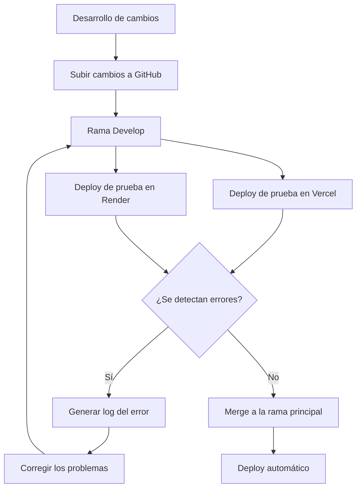

# Ideas, propuestas e información relevante

## 1. Prioridades y mejoras del sistema

### 1.1. Actualización de stock por parte de las tiendas
- Dar prioridad a que las tiendas puedan actualizar su propio stock desde el sistema.
- Facilitar la gestión del inventario de cada sucursal.
- Evaluar cómo se reflejarán las actualizaciones de stock en el sistema central.

### 1.2. Gestión de usuarios y personal (staff)
- Al momento de crear usuarios, enviar un correo electrónico que les permita generar su propia contraseña.
- Evitar que las contraseñas se compartan mediante chats u otros canales inseguros.
- Eliminar el método actual de doble verificación, que consiste en ingresar la contraseña del usuario y posteriormente una contraseña web.
- Reemplazar este mecanismo por el sistema de autenticación mediante QR, con una implementación más segura.

### 1.3. Vinculación de dispositivos mediante QR
- Añadir una funcionalidad que permita vincular un celular al QR.
- Definir el comportamiento del sistema una vez que el dispositivo haya sido vinculado.
- Evaluar los controles de seguridad necesarios para evitar accesos no autorizados.

## 2. Dashboard operativo y estadísticas

### 2.1. Dashboard operativo
- Revisar qué indicadores adicionales pueden visualizarse estadísticamente.
- Identificar información relevante para la toma de decisiones operativas.
- Evaluar la incorporación de indicadores relacionados con ventas, stock, citas, técnicos y sucursales.

### 2.2. Objetivos y resultados esperados
- Definir los objetivos del proyecto.
- Establecer los resultados esperados.
- Aclarar qué se busca conseguir con cada implementación.
- Determinar cómo se medirán los resultados y cómo se presentarán.

## 3. Hosting e infraestructura tecnológica

### 3.1. Sustento para el cambio de hosting
- Elaborar un documento que sustente la necesidad de cambiar de hosting.
- Presentar las razones, motivos y argumentos técnicos y operativos.
- Identificar los riesgos que se asumen al no realizar el cambio.
- Incluir cifras, métricas y evidencias que permitan justificar la decisión.
- Detallar los beneficios esperados del cambio de infraestructura.
- Utilizar el documento como sustento para solicitar acceso al hosting.

### 3.2. Infraestructura actual
- La empresa cuenta con un servidor propio.
- Está pendiente determinar si el servidor es físico o virtual.
- Identificar sus características, capacidad, configuración y uso actual.

## 4. Marketing y comunicación con clientes

### 4.1. Correos electrónicos de marketing
- Implementar correos de marketing con recomendaciones dirigidas a los usuarios.
- Los correos estarán relacionados con las campañas de marketing.
- Evaluar cómo se seleccionarán las recomendaciones y a qué usuarios se enviarán.

### 4.2. Reprogramación de citas por enfermedad del técnico
- Establecer un procedimiento para los casos en que un técnico se enferme y no pueda asistir.
- Notificar al cliente que su cita deberá ser reprogramada.
- Definir el mecanismo de comunicación y la coordinación de una nueva fecha.

## 5. Gestión de técnicos y capacidad operativa

### 5.1. Distribución de técnicos por sucursal
- Considerar una distribución de referencia de 2 técnicos por sucursal.
- San Miguel cuenta actualmente con 1 técnico.
- La Molina cuenta actualmente con 1 técnico.

### 5.2. Capacidad operativa diaria
- Se estima una capacidad de atención de 6 vehículos por día.
- Establecer rangos de horas para organizar las citas y la atención de los vehículos.
- Evaluar la capacidad de atención según la cantidad de técnicos disponibles en cada sucursal.

## 6. Gestión de vehículos, ventas y procesos administrativos

### 6.1. Vehículos contenedores
- Contenedor 118: Callao.
- Contenedor 338: Chancay.

### 6.2. ERP y gestión de ventas
- Implementar o evaluar un ERP para la gestión de ventas.
- Considerar la conexión con SUNAT.
- Integrar la información relacionada con Haily.
- Evaluar el proceso actual de registro manual mediante Google Drive.
- Revisar la posibilidad de que cada campo del registro aparezca individualmente para facilitar el ingreso y la gestión de la información.

### 6.3. Gestión de comisiones
- Actualmente, las comisiones se calculan mediante archivos de Google Drive.
- El cálculo varía dependiendo de la sucursal.
- Evaluar la centralización y automatización del cálculo de comisiones, considerando las particularidades de cada sucursal.

### 6.4. Página de la DUA
- Replicar la página de la DUA.
- Definir el alcance y las funcionalidades que deben reproducirse.

## 7. Seguimiento y presentación de resultados

### 7.1. Informe mensual de actividades
- Registrar mensualmente lo que se había planificado realizar.
- Comparar las actividades planificadas con las actividades efectivamente realizadas.
- Documentar los avances, resultados y pendientes.
- Presentar un informe al cierre de cada mes.

### 7.2. Informe anual
- Consolidar los informes mensuales.
- Presentar al finalizar el año un resumen de los objetivos planteados frente a los resultados obtenidos.
- Identificar los logros, las actividades pendientes y las oportunidades de mejora.

## 8. Pipeline de desarrollo y despliegue

### 8.1. Flujo de trabajo actual

### 8.2. Consideraciones del pipeline
- Los cambios se suben inicialmente a GitHub, a la rama `Develop`.
- Se realizan despliegues de prueba en Vercel y Render.
- Si se detectan errores, no se realiza el merge con la rama principal.
- Cuando ocurre un error, se genera un log que registra el fallo.
- Una vez corregidos los problemas y validados los cambios, se integran en la rama principal.
- Después del merge, se realiza el despliegue automático.

## 9. Pendientes por investigar o definir
- Determinar si el servidor propio de la empresa es físico o virtual.
- Identificar qué estadísticas adicionales deben incorporarse al dashboard operativo.
- Definir el funcionamiento y las restricciones de la vinculación de celulares mediante QR.
- Establecer los objetivos y resultados medibles de cada propuesta.
- Recopilar cifras y evidencias para justificar el cambio de hosting.
- Definir cómo se integrarán el ERP, SUNAT y Haily.
- Precisar el alcance de la réplica de la página de la DUA.
- Definir los rangos horarios de atención y la capacidad real de cada sucursal.
- Establecer el procedimiento de reprogramación de citas por ausencia o enfermedad de técnicos.
